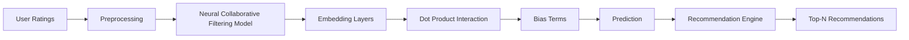

# MovieMate: Collaborative Filtering Movie Recommendation System

[](https://python.org)
[](https://tensorflow.org)
[](https://opensource.org/licenses/MIT)

MovieMate is a collaborative filtering-based movie recommendation system that provides personalized movie suggestions using deep learning techniques. The system analyzes user ratings to predict preferences and recommend new movies.


## Features

- 🧑 **User Rating System**: Collect and process user ratings
- 🎥 **Movie Database**: Comprehensive movie information
- 🤖 **Neural Collaborative Filtering**: Advanced deep learning model
- 📊 **Personalized Recommendations**: Top-N recommendations for each user
- 📈 **Performance Metrics**: MSE and MAE evaluation

## Installation

### Prerequisites
- Python 3.8+
- MySQL or MongoDB
- MovieLens dataset (download automatically or manually from [grouplens.org](https://grouplens.org/datasets/movielens/))

### Setup
1. Clone the repository:
```bash
git clone https://github.com/yourusername/MovieMate.git
cd MovieMate
```

2. Install dependencies:
```bash
pip install -r requirements.txt
```

3. Configure database:
- Create `.env` file with your database credentials:
```
DB_HOST=localhost
DB_PORT=3306
DB_USER=your_username
DB_PASSWORD=your_password
DB_NAME=moviemate
```

## Usage

### Training the Model
```bash
python train_model.py
```

### Generating Recommendations
```python
from recommender import recommend_movies

# Get recommendations for user ID 42
recommendations = recommend_movies(user_id=42, n=10)

for movie in recommendations:
    print(f"{movie['title']} (Predicted rating: {movie['predicted_rating']:.2f})")
```

### Example Output
```
The Shawshank Redemption (Predicted rating: 4.82)
The Godfather (Predicted rating: 4.79)
Pulp Fiction (Predicted rating: 4.77)
Fight Club (Predicted rating: 4.76)
Forrest Gump (Predicted rating: 4.75)
...
```

## Technical Architecture



## Model Configuration

| Parameter          | Default Value | Description                          |
|--------------------|---------------|--------------------------------------|
| `EMBEDDING_SIZE`   | 50            | User/movie embedding dimensions      |
| `REG_STRENGTH`     | 0.01          | L2 regularization strength           |
| `BATCH_SIZE`       | 64            | Training batch size                  |
| `EPOCHS`           | 10            | Number of training epochs            |
| `TEST_SIZE`        | 0.2           | Test set proportion                  |

## Dataset

MovieMate uses the [MovieLens Latest Small](https://grouplens.org/datasets/movielens/latest/) dataset:

| Dataset         | Users  | Movies | Ratings |
|-----------------|--------|--------|---------|
| ml-latest-small | 610    | 9,742  | 100,836 |

## API Integration

```python
from flask import Flask, request, jsonify
from model import load_model

app = Flask(__name__)
model = load_model('moviemate_model.h5')

@app.route('/recommend', methods=['POST'])
def recommend():
    user_id = request.json['user_id']
    n = request.json.get('n', 10)
    recommendations = recommend_movies(user_id, n)
    return jsonify(recommendations)

if __name__ == '__main__':
    app.run(port=5000)
```

## Contributing

We welcome contributions! Please follow these steps:

1. Fork the repository
2. Create a new branch (`git checkout -b feature/your-feature`)
3. Commit your changes (`git commit -am 'Add some feature'`)
4. Push to the branch (`git push origin feature/your-feature`)
5. Create a new Pull Request

## License

This project is licensed under the MIT License - see the [LICENSE](LICENSE) file for details.

## Acknowledgments

- MovieLens dataset provided by GroupLens Research
- TensorFlow and Keras teams for deep learning framework
- Pandas and NumPy for data processing
